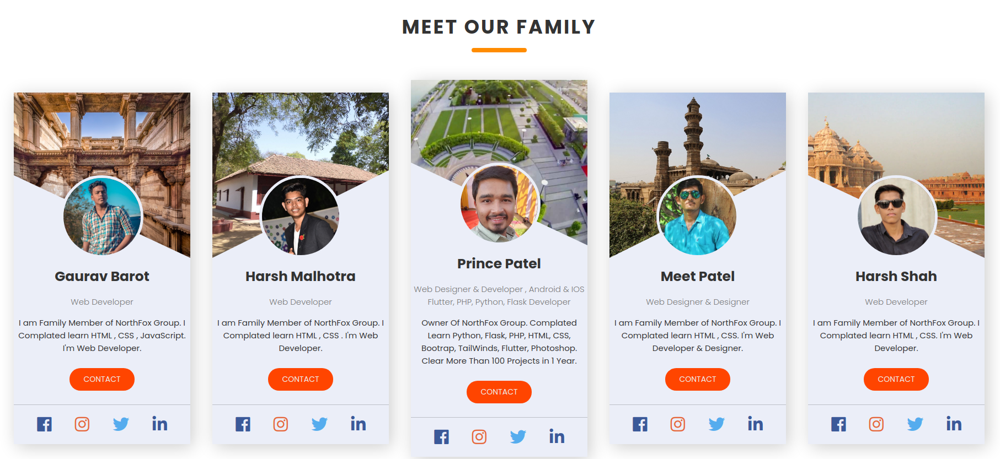
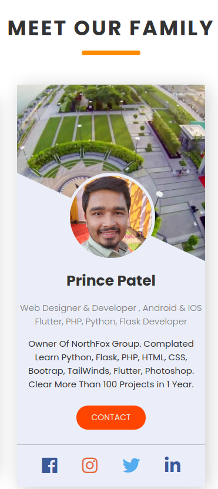

## Meet Our Family CSS Layout Free Source Code By NorthFox Developers

##### 📫 Connect with me here:<br />
 <br />
 <p>
  <a href="https://www.instagram.com/princu09">
    
  </a> &nbsp; 
  <a href="https://twitter.com/princu09">
    
  </a>&nbsp; 
  <a href="https://github.com/princu09">
    
  </a>&nbsp;
    <a href="https://www.t.me/proghub09">
    
  </a>
</p>



<center>


</center>

#### HTML File

```
<!DOCTYPE html>
<html lang="en">

<head>
    <meta charset="UTF-8">
    <meta name="viewport" content="width=device-width, initial-scale=1.0">
    <title>Meet Our Family</title>
    <link rel="stylesheet" href="style.css">
    <link rel="icon" href="https://princu09.github.io/nfwebbuilder/img/logo.png" type="image/png" sizes="16x16">
    <link rel="stylesheet" href="http://use.fontawesome.com/releases/v5.6.3/css/all.css">
</head>

<body>
    <section>
        <div class="container">
            <h1 class="heading">Meet Our Family</h1>
            <div class="card-wrapper">

                <div class="card">
                    
                    
                    <h1>Gaurav Barot</h1>
                    <p class="job-title">
                        Web Developer
                    </p>
                    <p class="about">
                        I am Family Member of NorthFox Group. I Complated learn HTML , CSS , JavaScript. I'm Web Developer.
                    </p>
                    <a href="#" class="btn">Contact</a>
                    <ul class="social-media">
                        <li><a href="http://www.facebook.com/NorthFoxGroup" target="_blank"><i
                                    class="fa fa-facebook"></i></a></li>
                        <li><a href="http://www.instagram.com/NorthFoxGroup" target="_blank"><i
                                    class="fa fa-instagram"></i></a></li>
                        <li><a href="http://www.twitter.com/NorthFoxGroup" target="_blank"><i
                                    class="fa fa-twitter"></i></a></li>
                        <li><a href="https://www.linkedin.com/in/princu09/" target="_blank"><i
                                    class="fa fa-linkedin"></i></a></li>
                    </ul>
                </div>

                <div class="card">
                    
                    
                    <h1>Harsh Malhotra</h1>
                    <p class="job-title">
                        Web Developer
                    </p>
                    <p class="about">
                        I am Family Member of NorthFox Group. I Complated learn HTML , CSS . I'm Web Developer.
                    </p>
                    <a href="#" class="btn">Contact</a>
                    <ul class="social-media">
                        <li><a href="http://www.facebook.com/NorthFoxGroup" target="_blank"><i
                                    class="fa fa-facebook"></i></a></li>
                        <li><a href="http://www.instagram.com/NorthFoxGroup" target="_blank"><i
                                    class="fa fa-instagram"></i></a></li>
                        <li><a href="http://www.twitter.com/NorthFoxGroup" target="_blank"><i
                                    class="fa fa-twitter"></i></a></li>
                        <li><a href="https://www.linkedin.com/in/princu09/" target="_blank"><i
                                    class="fa fa-linkedin"></i></a></li>
                    </ul>
                </div>

                <div class="card">
                    
                    
                    <h1>Prince Patel</h1>
                    <p class="job-title">
                        Web Designer & Developer , Android & IOS Flutter, PHP, Python, Flask Developer
                    </p>
                    <p class="about">
                        Owner Of NorthFox Group. Complated Learn Python, Flask, PHP, HTML, CSS, Bootrap, TailWinds, Flutter, Photoshop. Clear More Than 100 Projects in 1 Year.
                    </p>
                    <a href="#" onclick="MyCall()" class="btn">Contact</a>
                    <ul class="social-media">
                        <li><a href="http://www.facebook.com/NorthFoxGroup" target="_blank"><i
                                    class="fa fa-facebook"></i></a></li>
                        <li><a href="http://www.instagram.com/NorthFoxGroup" target="_blank"><i
                                    class="fa fa-instagram"></i></a></li>
                        <li><a href="http://www.twitter.com/NorthFoxGroup" target="_blank"><i
                                    class="fa fa-twitter"></i></a></li>
                        <li><a href="https://www.linkedin.com/in/princu09/" target="_blank"><i
                                    class="fa fa-linkedin"></i></a></li>
                    </ul>
                </div>
                <div class="card">
                    
                    
                    <h1>Meet Patel</h1>
                    <p class="job-title">
                        Web Designer & Designer
                    </p>
                    <p class="about">
                        I am Family Member of NorthFox Group. I Complated learn HTML , CSS. I'm Web Developer & Designer.
                    </p>
                    <a href="#" class="btn">Contact</a>
                    <ul class="social-media">
                        <li><a href="http://www.facebook.com/NorthFoxGroup" target="_blank"><i
                                    class="fa fa-facebook"></i></a></li>
                        <li><a href="http://www.instagram.com/NorthFoxGroup" target="_blank"><i
                                    class="fa fa-instagram"></i></a></li>
                        <li><a href="http://www.twitter.com/NorthFoxGroup" target="_blank"><i
                                    class="fa fa-twitter"></i></a></li>
                        <li><a href="https://www.linkedin.com/in/princu09/" target="_blank"><i
                                    class="fa fa-linkedin"></i></a></li>
                    </ul>
                </div>

                <div class="card">
                    
                    
                    <h1>Harsh Shah</h1>
                    <p class="job-title">
                        Web Developer
                    </p>
                    <p class="about">
                        I am Family Member of NorthFox Group. I Complated learn HTML , CSS. I'm Web Developer.
                    </p>
                    <a href="#" class="btn">Contact</a>
                    <ul class="social-media">
                        <li><a href="http://www.facebook.com/NorthFoxGroup" target="_blank"><i
                                    class="fa fa-facebook"></i></a></li>
                        <li><a href="http://www.instagram.com/NorthFoxGroup" target="_blank"><i
                                    class="fa fa-instagram"></i></a></li>
                        <li><a href="http://www.twitter.com/NorthFoxGroup" target="_blank"><i
                                    class="fa fa-twitter"></i></a></li>
                        <li><a href="https://www.linkedin.com/in/princu09/" target="_blank"><i
                                    class="fa fa-linkedin"></i></a></li>
                    </ul>
                </div>


            </div>
        </div>
    </section>

    <script>
        function MyCall() {
            alert("You can't call Now Sorry :) , This site for Demo Only. You Can Contact us on Social Media");
        }
    </script>
</body>

</html>
```

#### CSS File
```
@import url('https://fonts.googleapis.com/css2?family=Poppins:ital,wght@0,100;0,200;0,300;0,400;0,500;0,600;0,700;0,800;1,100;1,200;1,300;1,400;1,500;1,600;1,700&display=swap');

/* Created By NorthFox Group */

html {
    font-size: 10px;
    scroll-behavior: smooth;
}

* {
    margin: 0;
    padding: 0;
    font-family: 'Poppins', sans-serif;
    box-sizing: border-box;
}

a {
    text-decoration: none;
    color: #fff;
}

section {
    max-height: 100vh;
    padding: 10rem 0;
    background-color: #fff;
}

.heading {
    text-transform: uppercase;
    font-size: 3.5rem;
    letter-spacing: 3px;
    margin-bottom: 5rem;
    text-align: center;
    color: #333;
    position: relative;
}

.heading::after {
    content: "";
    width: 10rem;
    height: 0.8rem;
    background-color: darkorange;
    position: absolute;
    bottom: -2rem;
    left: 50%;
    transform: translateX(-50%);
    border-radius: 2rem;
}

.card-wrapper {
    display: flex;
    align-items: center;
    align-content: center;
    flex-direction: column;
}

.card {
    width: 32rem;
    background-color: #ebeef8;
    display: flex;
    flex-direction: column;
    align-items: center;
    justify-content: center;
    margin: 2rem 0;
    box-shadow: 0.5rem 0.5rem 3rem rgba(0, 0, 0, 0.2);
}

.card .card-img {
    width: 100%;
    height: 30rem;
    object-fit: cover;
    clip-path: polygon(100% 0%, 100% 42%, 100% 100%, 100% 100%, 0% 50%, 0 0);
}

.card .card-img2 {
    width: 100%;
    height: 30rem;
    object-fit: cover;
    clip-path: polygon(100% 0%, 100% 47%, 0 100%, 0 100%, 0% 50%, 0 0);
}

.profile-img {
    width: 15rem;
    height: 15rem;
    object-fit: cover;
    border-radius: 50%;
    margin-top: -15rem;
    z-index: 999;
    border: 0.5rem solid #ebeef8;
}

.profile-img:hover {
    border: 0.5rem solid orangered;
}

.card h1 {
    font-size: 2.5rem;
    color: #333;
    margin: 1.5rem 0;
}

.job-title {
    color: #777;
    font-size: 1.5rem;
    font-weight: 300;
    text-align: center;
}

.about {
    font-size: 1.5rem;
    margin: 1.5rem 0;
    text-align: center;
    color: #333;
}

.card .btn {
    padding: 1rem 2.5rem;
    background-color: orangered;
    border-radius: 2rem;
    margin: 1rem 0;
    text-transform: uppercase;
    color: #eee;
    font-size: 1.4rem;
    transition: all .5s;
}

.card .btn:hover {
    transform: translateY(-2px);
    box-shadow: .5rem .5rem 2rem rgba(0, 0, 0, .2);
}

.card .btn:active {
    transform: translateY(0);
    box-shadow: none;
}

.social-media {
    width: 100%;
    list-style: none;
    display: flex;
    justify-content: space-evenly;
    padding: 2rem 0;
    margin-top: 1.5rem;
    border-top: 1px solid rgba(0, 0, 0, .2);
}

.social-media i {
    font-size: 3rem;
}

.fa-facebook {
    color: #3b5999;
}

.fa-twitter {
    color: #55acee;
}

.fa-instagram {
    color: #e6683c;
}

.fa-linkedin {
    color: #3b5999;
}

.fa-linkedin:hover,
.fa-facebook:hover,
.fa-twitter:hover,
.fa-instagram:hover,
.fa-linkedin:hover {
    color: darkorange;
}

@media screen and (min-width: 700px) {
    .card-wrapper {
        flex-direction: row;
        flex-wrap: wrap;
        justify-content: center;
        align-items: center;
    }
    .card {
        margin: 2rem;
    }
    @keyframes fadeIn {
        from {
            opacity: 0;
        }
        to {
            opacity: 1;
        }
    }
    .card:nth-child(1) {
        animation: fadeIn 0.5s 0.5s backwards;
    }
    .card:nth-child(2) {
        animation: fadeIn 0.5s 1s backwards;
    }
    .card:nth-child(3) {
        animation: fadeIn 0.5s 1.5s backwards;
    }
    .card:nth-child(4) {
        animation: fadeIn 0.5s 2s backwards;
    }
    .card:nth-child(5) {
        animation: fadeIn 0.5s 2.5s backwards;
    }
}
```
